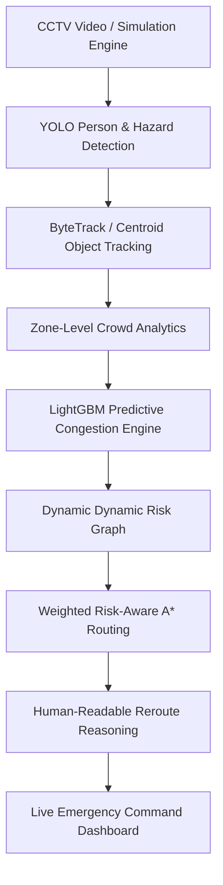

# ExitIQ - Project Plan & System Architecture

> **Tagline:** *"Nearest exit nahi. Safest exit."*  
> **Project:** AI-Powered Intelligent Emergency Evacuation & Dynamic Route Optimization System

---

## 1. Executive Summary & Objective

ExitIQ is a mission-critical emergency evacuation intelligence platform. Unlike static floor maps or naive shortest-path algorithms, ExitIQ evaluates real-time environment risks, crowd dynamics, hazard progression (fire/smoke), and **near-future crowd congestion predictions** (powered by LightGBM) to dynamically calculate and display the **safest** evacuation route.

---

## 2. Core Architecture Pipeline

---

## 3. Technology Stack

- **Frontend:** React 18, Vite, Tailwind CSS, Lucide React, HTML5 Canvas API (interactive tactical floor renderer)
- **Backend:** Python 3.11, FastAPI, Pydantic v2, Uvicorn, NetworkX
- **Predictive ML:** LightGBM, NumPy, Pandas, Scikit-Learn
- **Computer Vision & Tracking:** OpenCV, YOLO (Ultralytics), Centroid/ByteTrack tracker
- **Testing & Containerization:** PyTest, Docker, Docker Compose

---

## 4. Phased Implementation Roadmap

### Phase 1: Foundation Setup & Architecture Skeleton
- [x] Create project structure (`frontend/`, `backend/`, `data/`, `models/`, `docs/`, `tests/`)
- [x] Backend FastAPI application with CORS, state management, and `/health` endpoint
- [x] Tactical Emergency Operations Center UI layout (Dark mode `#090d16`, technical telemetry panels)

### Phase 2: Floor Map Model & Simulation Engine
- [x] Configurable building grid & node-edge graph schema (Rooms, Corridors, Exits, Zones)
- [x] Interactive HTML5 Canvas floor map with dynamic visual encoding
- [x] Simulation clock engine with real-time hazard/crowd event dispatching

### Phase 3: Dynamic Risk Model Engine
- [x] Dynamic edge risk cost evaluation formula:
  $$\text{Cost}(e) = \text{dist}(e) \times [1 + w_{\text{crowd}}\cdot\text{density} + w_{\text{hazard}}\cdot\text{hazard\_severity} + w_{\text{pred}}\cdot\text{pred\_congestion}]$$
- [x] Configurable risk model API endpoints for custom tuning

### Phase 4: Weighted Risk-Aware A* Routing & Explainability
- [x] Custom Risk-Aware A* algorithm optimizing safety + travel cost over pure distance
- [x] Real-time explainability generator detailing explicit reasoning ("Why Exit B instead of Exit A")
- [x] Handling "No Safe Route Available" edge cases when all paths are impassable

### Phase 5: Interactive Rerouting & Preset Demo Scenarios (1-6)
- [x] Scenario 1: Normal Evacuation (Shortest Safe Path)
- [x] Scenario 2: Fire Blocks Corridor (Auto Reroute around Fire)
- [x] Scenario 3: Exit Congestion (Reroute away from congested Exit A to Exit B)
- [x] Scenario 4: Predictive Congestion (Proactive reroute based on future LightGBM forecast)
- [x] Scenario 5: Multi-Hazard Escalation (Fire + Smoke + Panic Crowd)
- [x] Scenario 6: All Routes Blocked (Emergency Alert & Sheltering Advice)

### Phase 6: Synthetic Data Generator & LightGBM Prediction Engine
- [x] Synthetic evacuation dataset generator simulating zone crowd inflows, velocity, and congestion
- [x] LightGBM model training pipeline & predictor for near-future zone congestion probability
- [x] Model evaluation metrics (MAE, RMSE) & fallback comparisons (Random Forest / XGBoost scripts)

### Phase 7 & 8: Computer Vision & Tracking Engine
- [x] YOLO + OpenCV pipeline for processing prerecorded video / synthetic camera frames
- [x] Centroid / ByteTrack multi-object tracking for estimating person velocity & zone transitions
- [x] Zone analytics integration into the backend risk graph

### Phase 9: Telemetry & System Operational Metrics
- [x] Real-time metrics bar (Tracked People, Active Hazards, Route Risk Score, Latency ms, Prediction MAE)
- [x] UI telemetry graphs & status indicators

### Phase 10: Comprehensive Automated Testing Suite
- [x] Unit tests for Risk Engine, A* Routing, Simulation State, LightGBM Prediction, and Scenarios 1-6
- [x] Integration tests for FastAPI endpoints

### Phase 11: Dockerization & Container Deployment
- [x] Multi-stage `Dockerfile.backend` and `Dockerfile.frontend`
- [x] `docker-compose.yml` orchestrating API and Frontend services

### Phase 12: Documentation & Final Polish
- [x] Exhaustive `README.md` with visual architecture, setup guide, API reference, and scenario manual
- [x] Architecture docs in `docs/`
