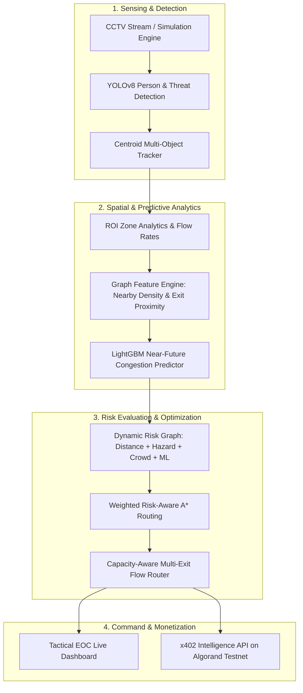

# ExitIQ
### AI-Powered Emergency Intelligence & Dynamic Evacuation Platform

> **Tagline:** *"Nearest exit nahi. Safest exit."*  
> **Project Type:** Real-Time Computer Vision, Predictive ML Congestion Forecasting, Risk-Aware Graph Optimization, and x402 Algorand Intelligence API.

---

## Overview

**ExitIQ** is an AI-powered Emergency Intelligence Platform designed for large, high-occupancy public and commercial facilities—including shopping malls, transit hubs, airports, hospitals, university campuses, stadiums, and convention centers. 

By continuously ingesting visual feeds and sensor data, ExitIQ transforms emergency management from a static safety map into a living, continuously adapting intelligence layer. The system detects active threats, forecasts near-future crowd bottlenecks before stampedes occur, calculates dynamic evacuation paths that route around danger, and provides facility operators and automated building systems with explainable, high-conviction emergency response directives.

---

## 1. The Problem: Static Evacuation Plans Fail in Dynamic Emergencies

Traditional emergency evacuation relies on static green exit signs and fixed architectural diagrams. In a real-world disaster, this paradigm breaks down rapidly:

- **Dynamic Threat Evolution:** Fire, smoke, toxic gases, or structural debris spread unevenly, suddenly cutting off designated primary escape paths.
- **Congestion & Stampede Risks:** Crowds instinctively rush toward the nearest familiar entrance/exit, causing deadly crush bottlenecks while secondary exits remain underutilized.
- **Deceptive Proximity:** The shortest physical path is frequently the most hazardous. Directing evacuees purely based on Euclidean proximity leads people straight into hazardous zones.
- **Lack of Predictive Awareness:** Standard building systems react only *after* a corridor is completely jammed or an exit is blocked, leaving zero reaction window for facility operations.

ExitIQ answers the critical operational question:  
**“What is the safest evacuation route and flow allocation RIGHT NOW, considering both current environmental risks and predicted crowd congestion?”**

---

## 2. The Solution: Detect → Predict → Optimize → Guide

ExitIQ operates across a continuous four-stage operational loop:

```
[ DETECT ]   →  What is happening across all zones right now? (YOLOv8 + Centroid Tracking)
     ↓
[ PREDICT ]  →  What will happen next? (LightGBM 1-min & 3-min congestion forecasting)
     ↓
[ OPTIMIZE ] →  What response minimizes risk & evacuation time? (Weighted Risk-Aware A*)
     ↓
[ GUIDE ]    →  Steer operators, IoT signage, and emergency responders to safety.
```

---

## 3. How ExitIQ Works: Technical Pipeline



### Pipeline Details

1. **CCTV Ingestion & YOLOv8 Detection:** Ingests live video or simulated floor concourse feeds. Uses YOLOv8 for frame-by-frame person detection and bounding box extraction.
2. **Centroid Tracking & Motion Vectors:** Assigns persistent IDs to detected individuals, computing velocity vectors ($dx, dy$) and instantaneous speeds to eliminate double-counting.
3. **Zone Mapping & Flow Metrics:** Projects bottom-center foot positions onto floor plan ROI polygons to extract zone density index ($0.0 - 4.5$), inflow rate, and outflow rate.
4. **Graph Topological Feature Extraction:** Derives structural graph metrics—including adjacent zone density diffusion (`nearby_density`) and Euclidean distance to nearest emergency exit (`exit_proximity`).
5. **LightGBM Congestion Forecasting:** Evaluates 8 spatial-temporal features to predict near-future congestion probability at $T+60\text{s}$ and $T+180\text{s}$ with sub-millisecond inference latency.
6. **Dynamic Risk Graph Construction:** Builds a directed NetworkX graph where each edge's traversal weight combines physical distance, fire/smoke multipliers, active crowd density, and predicted congestion:
   $$\text{Cost}(e) = \text{distance}(e) \cdot \left[ 1.0 + w_{\text{hazard}} R_{\text{hazard}} + w_{\text{crowd}} R_{\text{crowd}} + w_{\text{pred}} R_{\text{pred}} \right]$$
7. **Weighted Risk-Aware A\* Pathfinding:** Computes the globally safest evacuation corridor to available exits. If the nearest exit is compromised or congested, the engine selects the safest alternative path and generates natural language explainability justifications.
8. **Capacity-Aware Multi-Exit Flow Router:** Uses inverse-cost flow balancing to split large evacuee populations across multiple exits, preventing single-exit bottleneck saturation.
9. **Tactical Operations Dashboard & Voice Alerts:** Visualizes building topology, real-time hazard overlays, LightGBM forecasts, and automated Web Speech voice announcements for emergency operators.

---

## 4. Product Tiers: Core vs. Pro / Enterprise Intelligence

ExitIQ is structured into two functional layers:

```
┌────────────────────────────────────────────────────────────────────────┐
│ EXITIQ CORE                                                            │
│ Real-Time Emergency Awareness — "What is happening right now?"         │
├────────────────────────────────────────────────────────────────────────┤
│ • Active fire, smoke, and debris hazard detection                      │
│ • Live crowd density and zone count monitoring                         │
│ • Blocked corridor detection and static path avoidance                 │
│ • Real-time safest-route calculations                                  │
│ • Live Emergency Operations Center (EOC) Canvas Dashboard              │
└──────────────────────────────────┬─────────────────────────────────────┘
                                   │
                                   ▼
┌────────────────────────────────────────────────────────────────────────┐
│ EXITIQ PRO / ENTERPRISE                                                │
│ Predictive Emergency Intelligence — "What will happen next & what to do?"│
├────────────────────────────────────────────────────────────────────────┤
│ • LightGBM near-future crowd congestion forecasting (T+1m, T+3m)       │
│ • Bottleneck prediction and proactive surge bypass                     │
│ • Evacuation-time estimation and risk delta analytics                  │
│ • Capacity-aware multi-exit crowd flow balancing                       │
│ • What-If interactive emergency simulation scenarios                   │
│ • Automated explainability justifications ("Nearest exit ≠ Safest")   │
│ • x402 Machine-to-Machine Intelligence API                             │
└────────────────────────────────────────────────────────────────────────┘
```

### Feature Comparison Matrix

| Capability | ExitIQ Core | ExitIQ Pro / Enterprise | Status |
|---|:---:|:---:|:---:|
| Live Hazard & Smoke Detection | ✓ | ✓ | **Implemented** |
| Real-Time Zone Crowd Monitoring | ✓ | ✓ | **Implemented** |
| Dynamic Safest-Route Optimization | ✓ | ✓ | **Implemented** |
| Tactical EOC Floor Map Canvas | ✓ | ✓ | **Implemented** |
| Live CCTV Stream with Overlays | ✓ | ✓ | **Implemented** |
| LightGBM Near-Future Congestion Forecasting | — | ✓ | **Implemented** |
| Proactive Bottleneck Bypass Routing | — | ✓ | **Implemented** |
| Natural Language Reroute Explainability | — | ✓ | **Implemented** |
| Capacity-Aware Multi-Exit Flow Router | — | ✓ | **Implemented** |
| Preset What-If Scenarios (1–6) | — | ✓ | **Implemented** |
| Machine-to-Machine x402 Intelligence API | — | ✓ | **Implemented (Testnet Demo)** |
| Multi-Floor & Multi-Building Mesh | — | Planned | *Roadmap* |
| Building Management System (BACnet/IoT) Sync | — | Planned | *Roadmap* |

> [!IMPORTANT]
> **Ethical Design & Safety Guarantee:** Evacuation routes and safety alerts are public safety services. Individual evacuees are **never** charged to receive life-safety instructions. The monetization and API access models described below apply strictly to external systems, commercial facility operators, and automated third-party integrations consuming advanced intelligence streams.

---

## 5. Business Model: B2B Emergency Intelligence for Facilities

ExitIQ operates on a **B2B / Enterprise SaaS & API** model tailored for public venues and large infrastructure operators:

### Target Customers
- **Commercial & Retail:** Shopping malls, entertainment complexes, convention centers.
- **Transportation Hubs:** International airports, railway terminals, metro stations.
- **Healthcare & Education:** Multi-building hospital systems, university campuses.
- **Sports & Entertainment:** Stadiums, arenas, concert venues.
- **Corporate & Industrial:** High-rise corporate offices, manufacturing plants, logistics hubs.

### Value Proposition & Revenue Streams
1. **Facility Management Subscriptions:** Continuous emergency monitoring, dynamic risk scoring, and real-time dashboard licensing.
2. **Predictive Safety & Operations Add-On:** LightGBM bottleneck forecasting, capacity flow balancing, and historical surge analytics for security staffing optimization.
3. **Compliance & Simulation Tools:** What-If disaster scenario modeling for fire marshals, insurance risk auditors, and building safety certifications.
4. **Metered Emergency Intelligence API:** Machine-to-machine micropayment access for smart building automation, IoT signage controllers, autonomous security robotics, and mutual-aid emergency dispatch systems.

---

## 6. Programmable Monetization: x402 + Algorand Testnet Demonstration

ExitIQ integrates the **x402 protocol (Version 2)** on the **Algorand Testnet** to demonstrate how autonomous third-party systems can programmatically consume verified emergency intelligence via pay-per-query micropayments.

### The Problem x402 Solves
Modern smart buildings, emergency dispatch APIs, autonomous inspection drones, and insurance verification bots require on-demand, programmatic access to building intelligence without managing complex monthly API subscription contracts or exposing private API keys to third parties.

### How the x402 Intelligence API Works

```
  External System / IoT Signage Controller / Smart Building Hub
                             │
                             ▼  1. GET /api/v1/paid/emergency-analysis (Unpaid)
                   [ ExitIQ x402 Gateway ] (:4021)
                             │
                             ▼  2. HTTP 402 Payment Required Challenge
                             │     (Price: $0.005 USDC | Asset: 10458941 | Network: Testnet)
                             │
                  [ Pera Wallet (Browser Signer) ]
                             │
                             ▼  3. User / System signs ASA Transfer (5,000 atomic units)
                   [ GoPlausible Facilitator ]
                             │
                             ▼  4. Transaction submitted & settled on Algorand Testnet
                   [ Algorand Testnet Blockchain ]
                             │
                             ▼  5. Payment verified on-chain + PAYMENT-SIGNATURE validated
                   [ ExitIQ x402 Gateway ]
                             │
                             ▼  6. HTTP 200 OK + Verified Emergency Intelligence Payload
  External System receives real-time route, congestion predictions & hazard telemetry
```

### Payment Specifications (Demonstration Environment)
- **Protocol:** x402 V2 AVM Exact Payment Scheme (`@x402/core`, `@x402/avm`, `@x402/hono`).
- **Network:** Algorand Testnet (`algorand:SGO1GKSzyE7IEPItTxCByw9x8FmnrCDe`).
- **Payment Asset:** Testnet USDC ASA ID `10458941`.
- **Payment Amount:** `0.005 USDC` (5,000 atomic units).
- **Facilitator:** Real GoPlausible Facilitator (`https://facilitator.goplausible.xyz`).
- **Wallet Connector:** Pera Wallet via `@perawallet/connect` (zero seed phrase / private key exposure).
- **Protected Endpoint:** `GET /api/v1/paid/emergency-analysis`.

> [!NOTE]
> This payment layer is currently implemented and validated as an **Algorand Testnet demonstration** of agentic micropayments for machine-readable emergency intelligence. It does not represent live mainnet financial settlement.

---

## 7. Technology Stack

| Layer | Technologies | Purpose |
|---|---|---|
| **Frontend UI** | React 18, Vite, Tailwind CSS, Lucide React | Tactical Emergency Operations Center (EOC) dashboard. |
| **Canvas Graphics** | HTML5 2D Canvas API | High-performance floor plan rendering, hazard overlays, and route rendering. |
| **Backend API** | Python 3.11, FastAPI, Pydantic v2, Uvicorn | Simulation state management, CV ingestion, REST endpoints, and WebSocket support. |
| **Routing & Graphs** | NetworkX, Custom Risk-Aware A\* | Multi-factor evacuation pathfinding and capacity flow allocation. |
| **Predictive ML** | LightGBM, NumPy, Pandas, Scikit-Learn | Real-time crowd congestion forecasting and ML comparative benchmarks. |
| **Computer Vision** | OpenCV, YOLOv8 (Ultralytics), Centroid Tracker | Frame decoding, person detection, motion vector tracking, and ROI zone mapping. |
| **x402 Gateway** | TypeScript, Node.js, Hono, `@x402/core`, `@x402/avm`, `@x402/hono` | HTTP 402 payment challenge, GoPlausible facilitator proxy, and settlement verification. |
| **Blockchain / Web3** | Algorand Testnet, USDC ASA 10458941, `@perawallet/connect`, `algosdk` | Browser-based wallet connection, transaction signing, and on-chain payment proof. |
| **Testing & Tooling** | PyTest, Tsx, Vite Build, Docker | Automated unit tests, integration validation suites, and containerization. |

---

## 8. Key Features & Interactive Scenarios

### 1. Dual Operational Modes
- **Simulation Mode:** Standalone software mode for zero-hardware demonstration. Enables interactive scenario triggers, crowd modification, and custom hazard placement.
- **CCTV / Video Mode:** Real-time video processing pipeline utilizing YOLOv8 person detection, multi-object tracking, and dynamic ROI metrics.

### 2. Preset Demonstration Scenarios

| Scenario ID | Name | Operational Behavior |
|---|---|---|
| `NORMAL` | **1. Normal Evacuation** | All paths clear; calculates shortest safe path to nearest exit. |
| `FIRE_CORRIDOR` | **2. Fire Blocks Corridor** | Fire ignites in North Corridor; A\* dynamically reroutes evacuees around fire zone. |
| `EXIT_CONGESTION` | **3. Exit Congestion** | Extreme crowd surge at Exit A; system detects bottleneck and shifts route to Exit B. |
| `PREDICTIVE_CONGESTION` | **4. Predictive Congestion** | LightGBM foresees a 42% bottleneck surge; system proactively diverts traffic *before* blockage occurs. |
| `MULTI_HAZARD` | **5. Multi-Hazard** | Fire in North + Heavy Smoke in West; system resolves the only viable safe path through South concourse. |
| `NO_SAFE_ROUTE` | **6. No Safe Route** | All paths impassable; system broadcasts **"NO SAFE ROUTE"** and instructs shelter-in-place protocols. |

### 3. Explainability Rationale Engine
ExitIQ generates natural language justifications explaining why specific paths were selected over alternatives (e.g., *"Selected Exit B over Exit A: nearest exit is 15m shorter but carries 65% higher hazard risk. Nearest exit ≠ Safest exit."*).

### 4. ML Comparative Benchmark
Includes an active benchmark suite comparing LightGBM against XGBoost and Random Forest on Mean Absolute Error (MAE), Root Mean Squared Error (RMSE), $R^2$ score, and inference latency ($\mu\text{s}$).

---

## 9. Project Directory Structure

```
ExitIQ/
├── frontend/                  # React + Vite + Tailwind CSS tactical EOC interface
│   ├── src/
│   │   ├── components/        # Header, ScenarioBar, FloorMapCanvas, IntelligencePanel, BenchmarkPanel, TelemetryBar
│   │   ├── services/          # Axios API client (api.js) & Pera/x402 Payment Client (x402Payment.js)
│   │   ├── utils/             # Audio voice alert synthesizers (audio.js)
│   │   ├── App.jsx            # Main EOC application layout
│   │   └── main.jsx
│   ├── package.json
│   └── vite.config.js         # Configured with nodePolyfills for browser crypto/algosdk
├── backend/                   # FastAPI Python backend engine
│   ├── app/
│   │   ├── api/               # Simulation, Routing, Risk, Prediction, CV, Health endpoints
│   │   ├── cv/                # Video processor, ROI zone mapper, stream manager, pipeline
│   │   ├── tracking/          # Centroid multi-object tracker with velocity vectors
│   │   ├── prediction/        # LightGBM model, synthetic crowd generator, benchmark suite
│   │   ├── routing/           # Risk-Aware A*, Capacity-Aware flow router, graph features
│   │   ├── risk/              # Risk evaluation engine & weight manager
│   │   ├── simulation/        # Building map topology & simulation state engine
│   │   ├── models/            # Pydantic schemas (Node, Edge, Hazard, ZoneCrowd, etc.)
│   │   └── main.py            # FastAPI entrypoint
│   ├── tests/                 # 37 automated PyTest unit & regression test cases
│   └── requirements.txt
├── x402-gateway/              # TypeScript x402 V2 Algorand Gateway
│   ├── index.ts               # Hono server with paymentMiddleware & real backend proxy
│   ├── test.ts                # 8 automated integration validation tests for HTTP 402 challenge
│   ├── package.json
│   └── .env                   # AVM_ADDRESS, FACILITATOR_URL, PORT, PAYMENT_AMOUNT_USDC
├── docs/                      # Architecture, API, and methodology documentation
├── run_backend.py             # Root helper script to launch backend service
├── test_integration.py        # Root integration test suite
├── docker-compose.yml
├── Dockerfile.backend
├── Dockerfile.frontend
└── README.md
```

---

## 10. Quick Start Guide

### Prerequisites
- **Python:** 3.11+
- **Node.js:** 18+ & npm
- **Pera Wallet:** Browser extension or mobile app configured for **Algorand Testnet** (funded with Testnet ALGO for transaction fees and opted into USDC ASA `10458941`).

---

### Step 1: Start the Python Backend Service

```bash
# 1. Install backend dependencies
pip install -r backend/requirements.txt

# 2. Launch the backend server (from project root)
python run_backend.py
```
- **Backend API:** `http://localhost:8000`
- **Swagger Interactive Docs:** `http://localhost:8000/docs`

---

### Step 2: Start the x402 Payment Gateway

```bash
# 1. Navigate to gateway directory
cd x402-gateway

# 2. Install gateway dependencies
npm install

# 3. Start the gateway server
npm run dev
```
- **x402 Gateway:** `http://localhost:4021`
- **Protected Endpoint:** `http://localhost:4021/api/v1/paid/emergency-analysis`

---

### Step 3: Start the Frontend Dashboard

```bash
# 1. Navigate to frontend directory
cd frontend

# 2. Install frontend dependencies
npm install

# 3. Start Vite development server
npm run dev
```
- **Dashboard UI:** `http://localhost:3000`

---

## 11. Running Automated Tests

ExitIQ includes comprehensive automated test suites across all layers of the stack:

### 1. Backend Unit & Regression Suite
```bash
python -m pytest backend/tests -v
```
*Validates 37 test cases across the CV pipeline, Centroid tracking, dynamic risk weighting, graph building, Risk-Aware A\* routing, and Scenarios 1–6.*

### 2. Root Integration Suite
```bash
python -m pytest test_integration.py -v
```
*Validates end-to-end simulation state endpoints and dynamic recalculations.*

### 3. Gateway & HTTP 402 Integration Suite
```bash
cd x402-gateway
npm run test
```
*Validates all 8 gateway assertions: unpaid HTTP 402 status, Base64 `payment-required` header format, x402 V2 version, `exact` scheme, `ALGORAND_TESTNET_CAIP2`, USDC ASA `10458941`, receiver `payTo`, and exact 5,000 atomic unit pricing.*

---

## 12. Current Implementation Status & Roadmap

### Fully Implemented in Repository
- [x] YOLOv8 person detection and multi-object centroid tracking.
- [x] Image-to-graph ROI zone mapping with density index calculations.
- [x] LightGBM near-future crowd congestion forecasting engine.
- [x] Multi-factor Weighted Risk-Aware A\* routing with safety overrides.
- [x] Capacity-Aware Multi-Exit Flow balancing algorithm.
- [x] Interactive Tactical EOC Dashboard with HTML5 Canvas 2D floor map.
- [x] 6 preset disaster simulation scenarios with custom hazard injection.
- [x] Real-time audio voice alerts via Web Speech Synthesis.
- [x] Comparative ML Benchmark suite (LightGBM vs. XGBoost vs. Random Forest).
- [x] x402 V2 Payment Gateway listening on Algorand Testnet.
- [x] Pera Wallet Connect browser integration for zero-mnemonic signing.
- [x] Live on-chain Testnet settlement via GoPlausible Facilitator for USDC ASA 10458941.
- [x] 46 total automated tests (38 Python + 8 Gateway) passing with zero failures.

### Future / Production Roadmap
- [ ] **Multi-Camera Spatial Calibration:** Coordinate homography across multiple overlapping camera feeds.
- [ ] **Multi-Floor Vertical Evacuation:** Stairwell flow modeling and elevator emergency recall integrations.
- [ ] **Hardware Sensor Integration:** Native BACnet / MQTT integration with industrial smoke and thermal sensors.
- [ ] **Automated Dynamic Signage:** Direct IoT protocol integration with digital concourse exit signs.
- [ ] **Production Mainnet Payments:** Mainnet multi-sig vault settlement for enterprise M2M data feeds.

---

## 13. Why ExitIQ?

ExitIQ transforms emergency evacuation from a static safety plan into a **continuously aware, predictive, and risk-aware emergency intelligence system**.

Built for facilities that need to know not only where the danger is, but **where it is heading**.

---

## License

ExitIQ Project — Built for Intelligent Emergency Evacuation & Facility Safety.
