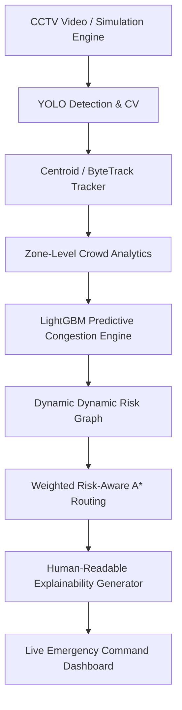

# ExitIQ

> **Tagline:** *"Nearest exit nahi. Safest exit."*  
> **Project:** AI-Powered Intelligent Emergency Evacuation & Dynamic Route Optimization System

---

## 1. Problem Statement

Static evacuation plans cannot adapt to changing emergency conditions. During a real building emergency:
- Fire/smoke may block a corridor unexpectedly.
- Crowd density may increase rapidly causing severe bottlenecks.
- An exit may become dangerously congested.
- The nearest exit may **NOT** be the safest exit.

ExitIQ answers:  
**“What is the safest evacuation route RIGHT NOW, considering both current risk and predicted future congestion?”**

---

## 2. System Architecture



---

## 3. Technology Stack

- **Frontend:** React 18, Vite, Tailwind CSS, Lucide React, HTML5 Canvas API (Tactical EOC Floor Map)
- **Backend:** Python 3.11, FastAPI, Pydantic v2, NetworkX, Uvicorn
- **Predictive ML:** LightGBM, NumPy, Pandas, Scikit-Learn
- **Computer Vision:** OpenCV, YOLO (Ultralytics), Multi-Object Centroid Tracker
- **Containerization & Testing:** Docker, Docker Compose, PyTest

---

## 4. Key Features

1. **Dual Modes:**
   - **Simulation Mode:** Standalone mode requiring zero hardware. Includes interactive scenario triggers and dynamic hazard injection.
   - **Video/CCTV Mode:** Processes video footage with YOLO person & hazard detection.
2. **Weighted Risk-Aware A* Routing:**
   Extends A* pathfinding to optimize for combined distance, crowd density, active fire/smoke severity, and predicted future congestion:
   $$\text{Cost}(e) = \text{distance}(e) \cdot \left[ 1.0 + w_{\text{hazard}} R_{\text{hazard}} + w_{\text{crowd}} R_{\text{crowd}} + w_{\text{pred}} R_{\text{pred}} \right]$$
3. **LightGBM Near-Future Congestion Predictor:**
   Forecasts zone congestion probability at $T+60\text{s}$ using 8 dynamic crowd features.
4. **Explainable Rerouting Engine:**
   Provides explicit natural language justifications for selected evacuation routes (e.g. *"Exit A avoided due to predicted 38% congestion surge"*).
5. **Tactical Emergency Operations Center (EOC) Dashboard:**
   Serious, technical, information-dense control room interface built with high-performance 2D Canvas rendering.

---

## 5. Preset Demo Scenarios (1 to 6)

| Scenario ID | Name | System Behavior |
|---|---|---|
| `NORMAL` | **1. Normal Evacuation** | Calculates shortest safe path to nearest exit when zero hazards exist. |
| `FIRE_CORRIDOR` | **2. Fire Blocks Corridor** | Fire ignites in North Corridor; A* dynamically redirects around fire zone. |
| `EXIT_CONGESTION` | **3. Exit Congestion** | Heavy crowd surge at Exit A; system reroutes evacuees to Exit B. |
| `PREDICTIVE_CONGESTION` | **4. Predictive Congestion** | LightGBM foresees 42% bottleneck surge; system proactively reroutes evacuees. |
| `MULTI_HAZARD` | **5. Multi-Hazard** | Fire in North + Heavy Smoke in West; system solves optimal remaining path. |
| `NO_SAFE_ROUTE` | **6. No Safe Route** | All paths impassable; system alerts **"NO SAFE ROUTE"** and advises sheltering. |

---

## 6. Project Directory Structure

```
ExitIQ/
├── frontend/                  # React + Vite + Tailwind CSS tactical EOC interface
│   ├── src/
│   │   ├── components/        # Header, ScenarioBar, FloorMapCanvas, IntelligencePanel, TelemetryBar
│   │   ├── services/          # Axios API client
│   │   ├── App.jsx            # Main EOC dashboard layout
│   │   └── main.jsx
│   ├── package.json
│   └── vite.config.js
├── backend/                   # FastAPI Python backend engine
│   ├── app/
│   │   ├── api/               # Health, Simulation, Routing, Risk, Prediction endpoints
│   │   ├── cv/                # YOLO & OpenCV video processing
│   │   ├── tracking/          # Centroid multi-object tracker
│   │   ├── prediction/        # LightGBM congestion predictor & synthetic generator
│   │   ├── routing/           # Weighted Risk-Aware A* algorithm
│   │   ├── risk/              # Risk evaluation engine & weight manager
│   │   ├── simulation/        # Building map loader & simulation engine
│   │   ├── models/            # Pydantic schemas
│   │   └── main.py            # FastAPI entrypoint
│   ├── tests/                 # PyTest automated test suite
│   └── requirements.txt
├── docs/                      # Architecture, API, Testing & Methodology docs
├── docker-compose.yml
├── Dockerfile.backend
├── Dockerfile.frontend
├── PROJECT_PLAN.md
└── README.md
```

---

## 7. Quick Start Guide

### Prerequisites
- Python 3.11+
- Node.js 18+ & npm

### A. Running Backend Service
```bash
# 1. Install backend Python dependencies
pip install -r backend/requirements.txt

# Option 1: Using the helper script from project root
python run_backend.py

# Option 2: Directly from backend folder
cd backend
python -m uvicorn app.main:app --reload --port 8000
```
Backend API will be accessible at: `http://localhost:8000` (Docs: `http://localhost:8000/docs`)

### B. Running Frontend Dashboard
```bash
# 1. Navigate to frontend directory
cd frontend

# 2. Install Node dependencies
npm install

# 3. Start Vite development server
npm run dev
```
Frontend Dashboard will be accessible at: `http://localhost:3000`

### C. Running via Docker Compose
```bash
docker-compose up --build
```

---

## 8. Running Automated Tests

```bash
python -m pytest backend/tests -v
```

All 10 automated test cases (covering risk formulas, graph building, Risk-Aware A*, and Scenarios 1-6) run cleanly.

---

## 9. Limitations & Future Scope

- **MVP Synthetic Baseline:** In the absence of live CCTV hardware in demo environments, synthetic datasets are used to train baseline LightGBM weights.
- **Future Scope:** Integration with IoT thermal/smoke sensor arrays and Unity 3D digital twin visualization.

---

## License

ExitIQ Hackathon Project — Built for Intelligent Emergency Evacuation.
