# ExitIQ Architecture Blueprint

> **Tagline:** *"Nearest exit nahi. Safest exit."*

## 1. System Core Architecture

ExitIQ is structured as a decoupled, microservices-ready intelligence engine.

```mermaid
flowchart LR
    subgraph Sensing & Data Layer
        CCTV[CCTV Video Streams]
        Sim[Simulation Engine Engine]
    end

    subgraph Perception Layer
        YOLO[YOLO Detection]
        Track[Centroid / ByteTrack Tracker]
        ZoneAnalytics[Zone Crowd Analytics]
    end

    subgraph Prediction & Intelligence Layer
        LightGBM[LightGBM Congestion Predictor]
        RiskEngine[Dynamic Risk Cost Function]
    end

    subgraph Decision Engine Layer
        GraphMesh[Dynamic NetworkX Risk Graph]
        RiskAStar[Weighted Risk-Aware A*]
        Explainability[Explainability Engine]
    end

    subgraph Operational Center Layer
        EOCUI[Tactical React EOC Interface]
    end

    CCTV --> YOLO --> Track --> ZoneAnalytics
    Sim --> ZoneAnalytics
    ZoneAnalytics --> LightGBM
    ZoneAnalytics --> RiskEngine
    LightGBM --> RiskEngine
    RiskEngine --> GraphMesh --> RiskAStar --> Explainability --> EOCUI
```

## 2. Component Breakdown

### A. Computer Vision & Object Tracking (`backend/app/cv` & `backend/app/tracking`)
- **YOLO Detection:** Runs real-time frame processing identifying persons (COCO Class 0) and environmental hazards.
- **Centroid Tracker:** Tracks bounding box centroids across time frames to calculate velocity vectors $v$, entry/exit rates per zone.

### B. Near-Future Predictive Model (`backend/app/prediction`)
- **LightGBM Regressor:** Evaluates 8 spatial-temporal features:
  $$\text{Features} = [\text{density}, \Delta\text{density}, \text{inflow}, \text{outflow}, \text{speed}, \text{nearby\_density}, \text{exit\_dist}, \text{hazard\_severity}]$$
- Output: Predicts $T+60\text{s}$ congestion probability $P_{\text{congestion}} \in [0.0, 1.0]$.

### C. Dynamic Weighted Graph & Risk Model (`backend/app/risk`)
- Edge dynamic cost calculation:
  $$\text{Cost}(e) = \text{distance}(e) \times \left( 1.0 + w_{\text{hazard}} \cdot R_{\text{hazard}} + w_{\text{crowd}} \cdot R_{\text{crowd}} + w_{\text{pred}} \cdot R_{\text{pred}} \right)$$

### D. Weighted Risk-Aware A* Pathfinder (`backend/app/routing`)
- Computes path $P^*$ minimizing total accumulated risk cost $g(n) + h(n)$.
- Guarantees safety override when **Shortest Path != Safest Path**.
- Generates natural language explainability logs.
